## Lecturer

```{r load_silent}
#| echo: false
library(igraph)
library(ggraph)
library(tidyverse)
library(networkdata)
```

#### Termeh Shafie

{width="300" height="300"}\
Statistician\
Statistical Modeling of Networks\
R enthusiast

::: {.fragment .center-x}
**and you?**
:::

## Overview

::::: columns
::: {.column width="45%"}
<br>

**Thursdays 10:00-11:30**\
Lecture, worksheets, discussions and live coding

<br>


:::

::: {.column width="49%"}
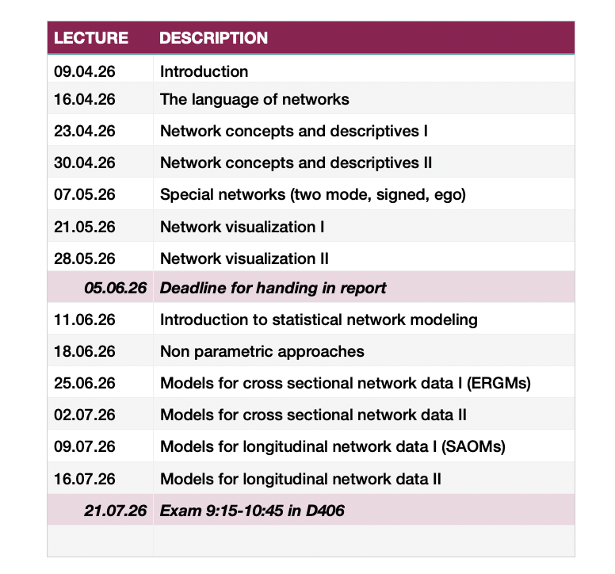
:::
:::::

## What do we cover?

::: {.text35 .center-x}
~~Research Design~~\
~~Data Collection~~\
Methodology
:::

(and some theory)

## Why study networks?

conventional research methods are often individual based and our models tend to model relations between variables

::: fragment
**but nature and culture is structured as networks**
:::

::: fragment
-   **society**
-   brain (neural networks)
-   organizations (who reports to whom)
-   economies (who sells to whom)
-   ecologies (who eats whom)
:::

::: fragment
**Position within a network is important for predicting outcomes**
:::

## Why study networks?

Simmel, 1908/1971:

> *Society exists where a number of individuals enter into interaction*

Durkheim, 1974:

> *Society has for its substratum the mass of associated individuals. The system which they form by uniting together \[...\] their channels of communication \[are\] the basis from which social life is raised*

Marx, 1973:

> *Society does not consist of individuals, but expresses the sum of interrelations, the relations within which these individual stand*

## Why study networks?

...but conventional research methods are often individual based and our models tend to model relations between variables, not people

. . .

### Example

David eats predominantly vegetarian food

:::::: columns
::: {.column width="30%"}

:::

::: {.column width="30%"}
individual-based:

-   ethical
-   economic
-   health
-   taste
:::

::: {.column width="35%"}
network-based:

-   vegetarian partner/friends
:::
::::::

## Why study networks?

...but conventional research methods are often individual based and our models tend to model relations between variables, not people

### Example

::::: columns
::: {.column width="30%"}

:::

::: {.column width="55%"}
Someone close to you is unhappy...

...will you remain unaffected?
:::
:::::

## Why study networks?

...but conventional research methods are often individual based and our models tend to model relations between variables, not people

### Example

::::: columns
::: {.column width="40%"}

:::

::: {.column width="55%"}
equal opportunities based on our individual qualities...

...or on our personal networks?
:::
:::::

## From "ordinary" to network data

::::::: r-stack
::: fragment
:::

::: fragment
```{r monadic1}
#| echo: false
set.seed(1111)
tbl <- tibble(x=runif(20),y=runif(20),id=1:20)

ggplot(tbl,aes(x,y)) +
  geom_point(size=8,col="#1a162d") +
  theme_void()+
  theme(plot.background = element_rect(fill="white",color=NA))

```
:::

::: fragment
```{r monadic2}
#| echo: false
el <- matrix(
  c(4,11,
    8,2,
    10,16,
    12,3,
    9,14,
    1,18,
    5,20,
    7,15,
    19,6,
    13,17),byrow=TRUE,ncol=2
) |> as_tibble()

el$x <- tbl$x[el$V1]
el$xend <- tbl$x[el$V2]
el$y <- tbl$y[el$V1]
el$yend <- tbl$y[el$V2]

ggplot() +
  geom_point(data=tbl,aes(x,y),size=8,col="#1a162d") +
  geom_segment(data=el,aes(x,y,xend=xend,yend=yend),col="#1a162d",alpha=0.5)+
  theme_void()+
  theme(plot.background = element_rect(fill="white",color=NA))

```
:::

::: fragment
```{r dyadic}
#| echo: false
el <- matrix(
  c(4,11,
    8,2,
    10,16,
    12,3,
    9,14,
    1,18,
    5,20,
    7,15,
    19,6,
    13,17,
    11,8,
    8,10,
    4,8,
    16,2,
    1,2,
    2,18,
    18,14,
    13,14,
    20,7,
    15,19,
    17,19,
    12,9,
    9,13,
    3,17,
    20,15),byrow=TRUE,ncol=2
) |> as_tibble()

el$x <- tbl$x[el$V1]
el$xend <- tbl$x[el$V2]
el$y <- tbl$y[el$V1]
el$yend <- tbl$y[el$V2]

ggplot() +
  geom_point(data=tbl,aes(x,y),size=8,col="#1a162d") +
  geom_segment(data=el,aes(x,y,xend=xend,yend=yend),col="#1a162d",alpha=0.5)+
  theme_void()+
  theme(plot.background = element_rect(fill="white",color=NA))
```
:::
:::::::

## From "ordinary" to network data

<br>

::: fragment
**atomic data**\
individuals or entities
:::

::: fragment
**dyadic data**\
dependent pairs of individuals (e.g. couples)\
but treated as independent entities
:::

::: fragment
**networks**\
interdependent and overlapping dyads\
usual (statistical) independence assumptions do not hold
:::

## 4 pillars of network analysis

::: text15
1.  Social network analysis is motivated by a structural intuition based on ties linking social actors

2.  It is grounded in systematic empirical data

3.  It draws heavily on graphic imagery

4.  It relies on the use of mathematical and/or computational models
:::

# Brief history of SNA

## Beginings in Sociology

::::: columns
::: {.column width="30%"}
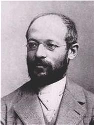
:::

::: {.column width="70%"}
**Georg Simmel (1858–1918)**

-   pioneered the concept of social structure
-   developed early structural theories
-   dyads and triads
:::
:::::

> *If there is to be a science whose subject matter is society and nothing else, it must exclusively investigate these interactions, these kinds and forms of sociation.*

## Sociometry

::::: columns
::: {.column width="30%"}
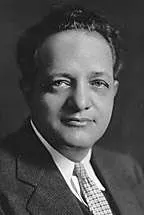
:::

::: {.column width="70%"}
**Jacob Moreno (1889–1974)**

-   sociometry
-   sociogram
-   **together with Helen Hall Jennings**
:::
:::::

::: center-x
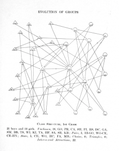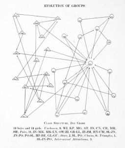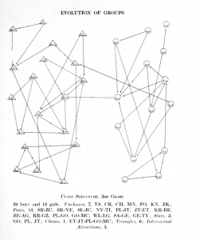
:::

## Sociometry

::::: columns
::: {.column width="30%"}

:::

::: {.column width="70%"}
**Jacob Moreno (1889–1974)**

-   sociometry
-   sociogram
-   **together with Helen Hall Jennings**
:::
:::::

::: center-x
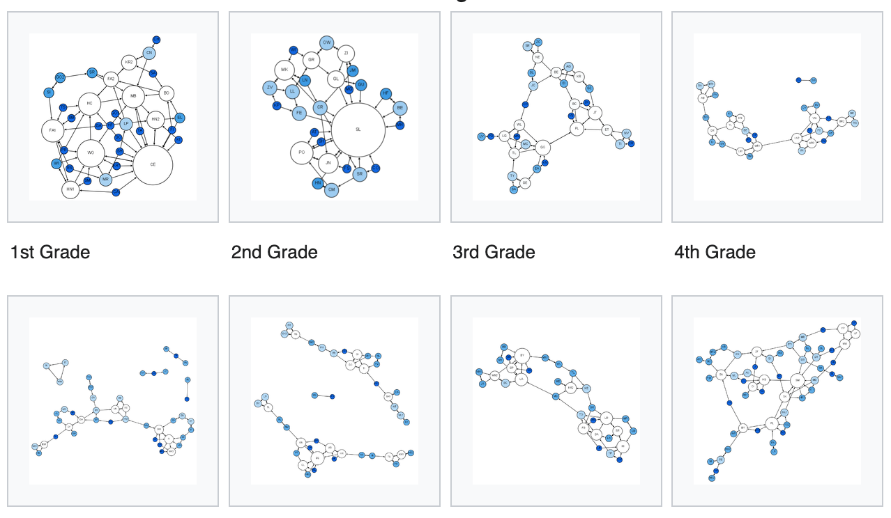{width="530"}
:::

## Network position and outcome

::::: columns
::: {.column width="30%"}

:::

::: {.column width="70%"}
**Alex Bavelas (1913-1993)**

-   information diffusion within small groups\
-   influence of network structure on efficiency
-   developed the concept of centralization
:::
:::::

::: center-x
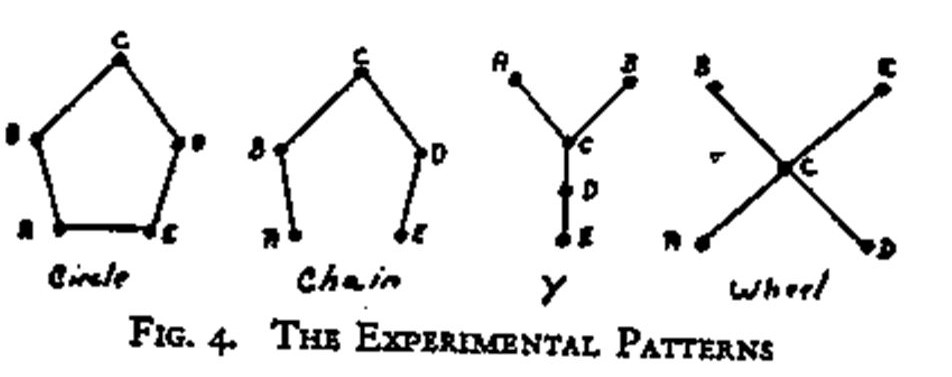{width="600"}
:::

## Network theory

::::: columns
::: {.column width="30%"}
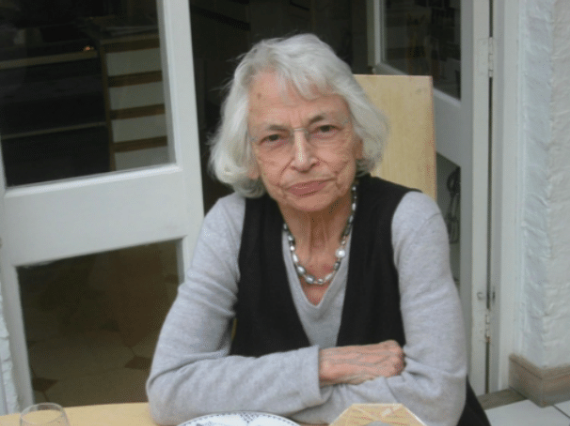
:::

::: {.column width="70%"}
**Elizabeth Bott (1924–2016)**

-   Manchester School of Anthropology
-   developed the first network theory
:::
:::::

**Bott hypothesis**\
the density of a husband’s and wife’s separate social networks is positively associated with marital role segregation

## And then the Physicists came

::::: columns
::: {.column width="25%"}

:::

::: {.column width="60%"}
**Barabási/Watts & Strogatz**

-   Preferential attachment/Small world
-   SNA vs. complex networks
-   Popularized the network concept
:::
:::::

::: text09
> *I expressed the pious hope that \[...\] our colleagues from physics would simply join in the collective enterprise. That hope, however, was not immediately realized. These physicists, new to social network analysis, did not read our literature; they acted as if our sixty years of effort amounted to nothing...* (L. Freeman)
:::

# Doing SNA

## Levels of Analysis

::: fragment
**dyad level**\
Fundamental unit of network data collection\
("Does sharing offices lead to friendship?")
:::

::: fragment
**node level**\
Aggregation of dyad level measurement\
("Do actors with more friends have a stronger immune system?")
:::

::: fragment
**network level**\
Assessing overall structure of a network\
("Do well connected networks diffuse ideas faster?")
:::

::: {.fragment .text08}
more levels are possible (triads, groups, ...)
:::

## Types of relations I

<br>

::: fragment
**Relational states**

-   Similarities: location, participation, attribute\
-   Relational roles: kinship, other roles\
-   Relational cognition: affective, perceptual
:::

::: fragment
**Relational events**

-   Interactions: sold to, talked to, helped, ...
-   Flows: information, belief, money
:::

## Types of relations II

<br>

::: fragment
**undirected**\
symmetric relation
:::

::: fragment
**directed**\
asymmetric relation, but can be bi-directional
:::

::: fragment
**valued**\
strength of relation, frequency of contact, etc.
:::

::: fragment
**signed**\
positive and negative relations
:::

::: fragment
**or a mixture thereof**
:::

## Goals of analysis

::: fragment
**Network variables as independent/explanatory**

> *Using network theory to explain the consequences of network properties*

social capital, brokerage, adoption of innovation
:::

::: fragment
**Network variables as dependent/outcomes**

> *Using \_\_\_\_\_\_ theory to explain the antecendents of a network*

homophily, balance theory
:::

## Node Level

| **type** | **independent** | **dependent** | **ex. hypotheses** |
|------------------|------------------|------------------|------------------|
| *network theory* | node level network property | actor attribute | centrality ⟹ performance |
| *theory of networks* | actor attribute | node level network property | good looks ⟹ centrality |

## Dyad Level

| **type** | **independent** | **dependent** | **ex. hypotheses** |
|------------------|------------------|------------------|------------------|
| *network theory* | network tie | attribute similarity | friends ⟹ similar interest |
| *theory of networks* | attribute similarity | network tie | smoking ⟹ friendship |

# Some Examples

## The strength of weak ties

```{r weak_ties}
#| echo: false
#| fig.width: 8
#| fig.height: 3
g <- structure(c("A", "A", "A", "B", "B", "D", "A", "E", "D", "B", 
                 "A", "F", "G", "D", "B", "B", "I", "I", "J", "K", "J", "I", "C", 
                 "C", "C", "C", "B", "F", "F", "D", "E", "E", "F", "F", "E", "D", 
                 "H", "H", "G", "G", "H", "L", "J", "K", "L", "L", "K", "I", "L", 
                 "K"), dim = c(25L, 2L)) |> graph_from_edgelist(FALSE)
E(g)$tie <- "strong"
E(g)$tie[1] <- "weak"
V(g)$focus <- FALSE
V(g)$focus[c(1,2)] <- TRUE
xy <- graphlayouts::layout_with_stress(g)
xy <- graphlayouts::layout_mirror(xy)
xy <- graphlayouts::layout_mirror(xy,"horizontal")
g_lay <- create_layout(g,"manual",x=xy[,1],y=xy[,2])
ggraph(g_lay) +
  geom_edge_link0(aes(edge_width = tie),edge_color="grey66",show.legend = FALSE) + 
  geom_node_point(shape=21,size=6,fill="grey25",aes(color=focus),show.legend = FALSE,stroke=1)+
  geom_node_text(aes(label = name,filter=(name%in%LETTERS[1:3])),color="white",fontface="bold")+
  scale_edge_width_manual(values=c(2,0.5))+
  scale_color_manual(values=c("white","#ffd700"))+
  theme_graph(background = "#333333")+
  coord_cartesian(clip="off")
```

**Strong ties** have redundant information for individuals\
**Weak ties** spread information between groups

[Link to paper](https://www.cs.cmu.edu/~jure/pub/papers/granovetter73ties.pdf)

## The spread of obesity

<br>

::::: columns
::: {.column width="50%"}
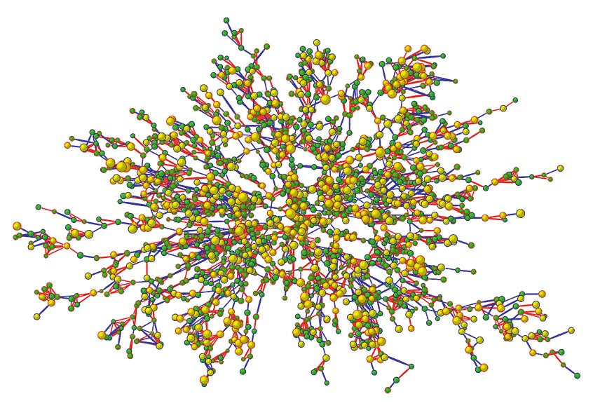
:::

::: {.column width="50%"}
A person's chances of becoming obese increased by 57% if he or she had a friend who became obese in a given interval \[...\] These effects were not seen among neighbors in the immediate geographic location.
:::
:::::

[Link to paper](https://www.nejm.org/doi/full/10.1056/nejmsa066082)

## Lethality and centrality

::::: columns
::: {.column width="60%"}
The correlation between the connectivity and indispensability of a given protein confirms that, despite the importance of individual biochemical function and genetic redundancy, the robustness against mutations in yeast is also derived from the organization of interactions and the **topological positions of individual proteins**.
:::

::: {.column width="40%"}
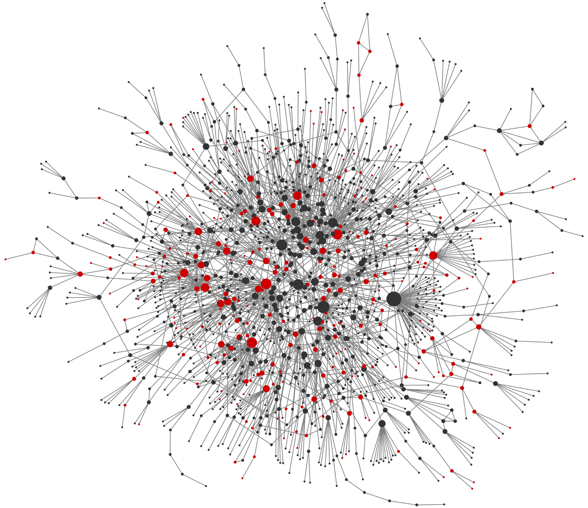
:::
:::::

[Link to paper](https://www.nature.com/articles/35075138)

## Social licking among cows

::::: columns
::: {.column width="40%"}
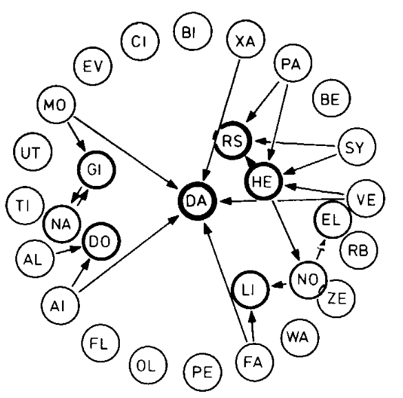
:::

::: {.column width="40%"}
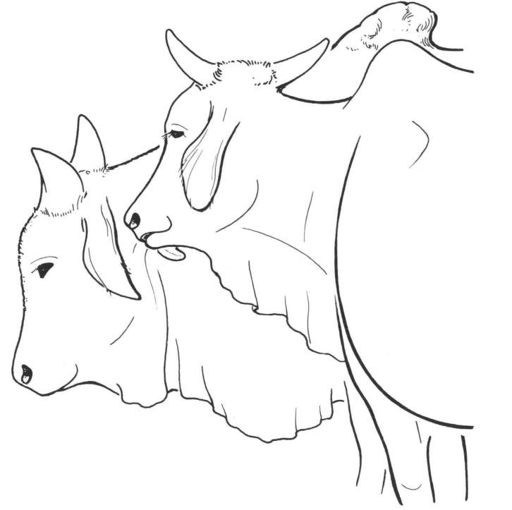
:::
:::::

[Link to paper](https://brill.com/view/journals/beh/77/3/article-p121_1.xml)

**Most methods rely on concepts from graph theory**

# R ecosystem for networks

## Why R?

<br>

::::::::: columns
:::: {.column width="32%"}
::: {.frame-box .center-x}
\
open source
:::
::::

:::: {.column width="32%"}
::: {.frame-box .center-x}
  \
cross-platform
:::
::::

:::: {.column width="32%"}
::: {.frame-box .center-x}
\
CRAN
:::
::::
:::::::::

::::::::: columns
:::: {.column width="32%"}
::: {.frame-box .center-x}
\
reproducibility
:::
::::

:::: {.column width="32%"}
::: {.frame-box .center-x}
\
more than SNA
:::
::::

:::: {.column width="32%"}
::: {.frame-box .center-x}
\
community
:::
::::
:::::::::

## Packages for basic SNA

<br>

`igraph`

-   offers efficient data structures
-   implemented in C (also available in python)

::: fragment
`sna`

-   relies on the network package
-   "clone" of UCINET
:::

## Package dependencies

```{r crannet_depend}
#| echo: false
#| fig.height: 10
#| fig.width: 11
#| fig.cap: "CRAN packages that depend on igraph, network, and graph"
sg <- readRDS("data/crannet.RDS")
ggraph(sg,"stress")+
  geom_edge_link0(edge_color="grey66", edge_width=0.3,
                  arrow = arrow(angle = 15, length = unit(0.15, "inches"),
                                ends = "last", type = "closed"))+
  geom_node_point(shape=21,aes(fill=col,size=seed))+
  scale_fill_brewer(type="qual",name="")+
  scale_size_manual(values = c(3,8),guide="none")+
  guides(fill = guide_legend(override.aes = list(size=8)))+
  theme_graph()+
  theme(legend.position = "bottom",legend.text = element_text(size=16))
```

## Which package to choose?

<br>

use `igraph` if

-   you need speed (large networks)
-   you need to use other SNA packages

::: fragment
use `sna` if

-   you need to do modeling (e.g. ERGMs and RSIENA)
:::

::: fragment
**does not make a difference in most cases, never load them both!**

```{r load igraph}
#| eval: false
#| echo: true
library(igraph)
```
:::
